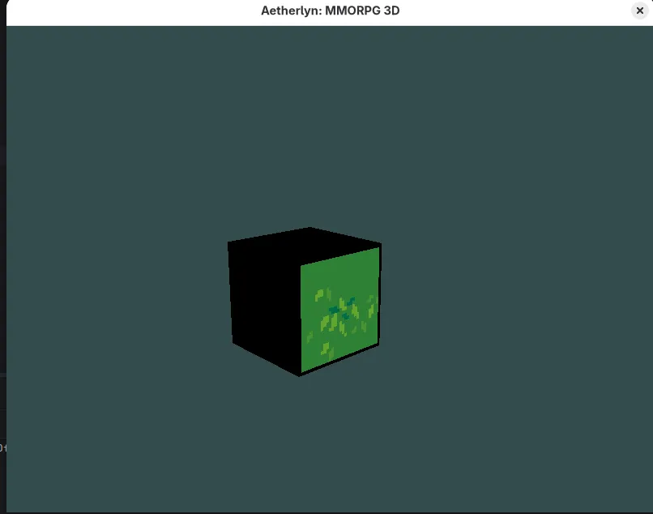

# Aetherlyn

> An open-world MMORPG prototype built in Java, inspired by *Haven & Hearth* and *Overlord*.



---

## What is Aetherlyn?

Aetherlyn is a sandbox MMORPG where players explore a persistent open world, gather resources, survive, and build power — including dark paths like becoming a lich and commanding undead minions.

The project is built around a **dual-client architecture**: both clients connect to the same game world and server, but offer different visual experiences:

| Client | Renderer | Perspective |
|--------|----------|-------------|
| **3D Client** | LWJGL + OpenGL + GLSL | Isometric |
| **2D Client** | LibGDX (planned) | Isometric |

---

## Current State

The project is in active development. The **3D client** currently features:

### ✅ Phase 1 — Foundation (complete)
- Isometric camera with Q/E rotation (smooth ease-out interpolation)
- Point-and-click movement with raycasting
- Scroll zoom
- Fixed timestep game loop (60 TPS logic / uncapped render)
- Organized package structure (`core`, `camera`, `input`, `rendering`, `debug`, `world`)
- F3 debug panel (FPS, TPS, position, zoom, camera angle, seed)
- Ctrl+G debug grid overlay

### 🔄 Phase 2 — World (in progress)
- ✅ Terrain grid rendered from `terrain.png` spritesheet (32×32px tiles)
- ✅ Procedural map generation via Perlin Noise + FBM (4 tile types: grass, dirt, stone, water)
- ✅ Island-shaped maps with natural water borders
- ✅ Static objects (stone, bush) with billboard rendering and circular collision
- ✅ Player cannot walk on water or through objects
- 🔲 Chunk system
- 🔲 2D client setup (LibGDX)

### 🔲 Phase 3 — Entities
- Player entity with inventory
- Monster AI (skeleton, lich)
- Basic combat system
- HUD

### 🔲 Phase 4 — Server
- KryoNet multiplayer
- SQLite persistence
- Shared world for 2D and 3D clients

### 🔲 Phase 5 — Dark Path
- Lich transformation
- Undead army management
- Phylactery mechanic

---

## Tech Stack

| Layer | Technology |
|-------|------------|
| Language | Java 21 |
| 3D Rendering | LWJGL 3, OpenGL 3.3, GLSL |
| Math | JOML |
| 2D Rendering | LibGDX (planned) |
| Networking | KryoNet (planned) |
| Database | SQLite (planned) |
| Build | Maven |

---

## Project Structure

```
src/main/java/com/angelo/mmorpg/
├── Game.java                  — entry point, main loop
├── camera/
│   └── Camera.java            — isometric camera, rotation, raycasting
├── core/
│   ├── Window.java            — GLFW window management
│   └── ResourceLoader.java    — textures and shaders via classpath
├── debug/
│   ├── DebugState.java        — F3 / Ctrl+G toggle flags
│   ├── DebugInfo.java         — debug data container
│   └── DebugRenderer.java     — STB TrueType text overlay
├── input/
│   └── InputHandler.java      — mouse, keyboard, point-and-click
├── rendering/
│   ├── Renderer.java          — player billboard sprite
│   ├── TerrainRenderer.java   — terrain tile mesh
│   ├── ObjectRenderer.java    — static object billboard sprites
│   └── GridRenderer.java      — debug grid overlay
└── world/
    ├── WorldMap.java          — tile grid, procedural generation
    ├── PerlinNoise.java       — Perlin Noise + FBM implementation
    └── StaticObject.java      — stone, bush with collision
```

---

## Controls

| Input | Action |
|-------|--------|
| Left click | Move player |
| Q / E | Rotate camera 45° |
| Scroll | Zoom in/out |
| F3 | Toggle debug panel |
| Ctrl+G | Toggle debug grid |
| ESC | Quit |

---

## How to Run

### Requirements

- Java JDK 21
- IntelliJ IDEA Community (recommended)
- Linux system dependencies:

```bash
sudo apt install libgl1-mesa-dev libglfw3-dev libopenal-dev
```

### Setup

```bash
git clone https://github.com/Galauk/Aetherlyn
cd Aetherlyn
mvn clean install
java -jar target/Aetherlyn-1.0-SNAPSHOT.jar
```

All assets are bundled — no manual file placement needed.

---

## Inspiration

- [Haven & Hearth](https://www.havenandhearth.com/) — persistent open world, survival and crafting depth
- *Overlord* — dark fantasy theme, commanding minions, morality through power